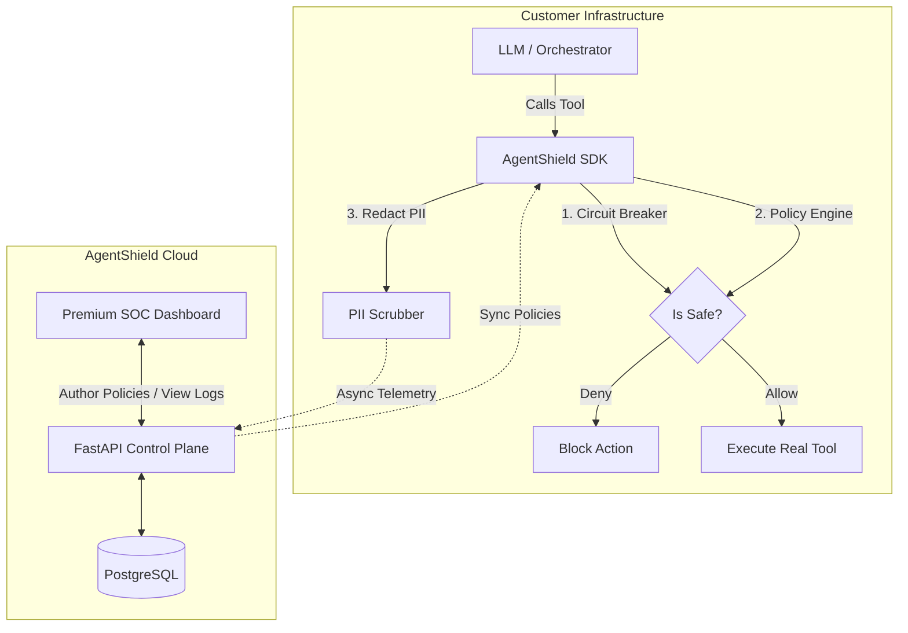

# AgentShield: Architecture & Product Vision

## 1. What Have We Built & How?
We have built an **Enterprise Agent Governance Platform**. It is a full-stack SaaS that acts as a secure control plane for autonomous AI agents. 

**How we built it:**
We implemented a split-plane architecture:
*   **The Data Plane (Python SDK):** A lightweight, extremely fast Python library (`packages/sdk-python`) that runs locally inside the customer's infrastructure. It contains a local Policy Engine (mocking Microsoft AGT), a PII Redaction Engine, and Circuit Breakers.
*   **The Control Plane (FastAPI + PostgreSQL):** A centralized backend (`apps/api`) that ingests asynchronous telemetry from the SDKs and distributes updated security policies back to the edge.
*   **The Enterprise SOC (React + Tailwind):** A premium, glassmorphic Security Operations Center (`apps/web`) where CISOs and security teams can visualize agent activity and author deterministic YAML guardrails.

## 2. Who is Going to be Using This?
There are two distinct personas for this product:

1.  **The Implementer (VP of Engineering / Lead Dev):** They are responsible for installing the Python SDK. Their goal is to build AI agents without having to manually code security guardrails, circuit breakers, and compliance logs from scratch.
2.  **The Buyer (CISO / Compliance Officer):** They are the ones logging into the web Dashboard. Their goal is to ensure that the company's AI agents aren't leaking PII, issuing massive unauthorized refunds, or executing malicious code. They buy the product for the "Live Intercept Feed" and the "Compliance Score."

## 3. How Are They Going to Use This?
**The Engineering Team** installs the SDK via `pip install agentshield`. They wrap their existing agent tools with our zero-friction wrappers and deploy their application. 
**The Security Team** logs into the AgentShield Dashboard. If they notice an agent is taking risky actions, they use the "Rule Builder" to deploy a new policy (e.g., "Block refunds over $500"). The Control Plane syncs this YAML policy down to the SDK. The very next time the agent tries to issue a $600 refund, the SDK intercepts the action natively, blocks it, and alerts the dashboard.

## 4. Is it Worth Creating a CLI?
**Yes, absolutely.** A CLI (e.g., `agentshield-cli`) is the ultimate developer experience (DX) moat. 
While the web dashboard is for the CISO, the CLI is for the developer. A CLI would allow developers to:
*   `agentshield init`: Automatically detect if they are using Langchain/AutoGen and auto-inject the `ShieldedTool` wrappers into their codebase.
*   `agentshield scan`: Statically analyze their codebase for "Shadow AI" (unprotected LLM calls).
*   `agentshield test`: Run local simulations against their guardrails in CI/CD pipelines before deploying to production.

## 5. The Architecture (Visualized)


## 6. Is This Only For LangChain & Orchestrators?
**No. It is framework agnostic.**
While we built native plugins for orchestration engines like LangChain, AutoGen, and CrewAI because that's where the friction currently is, the core SDK can govern *any* Python function. 

If a developer isn't using a framework and is just writing raw Python scripts that call the OpenAI API directly, they can simply use our `@govern` decorator on their regular Python functions:

```python
from agentshield import govern

@govern(action_type="custom_api_call")
def my_raw_function(user_id, amount):
    # This function is now protected by AgentShield policies,
    # circuit breakers, and telemetry.
    pass
```

This means AgentShield acts as a universal PEP (Policy Enforcement Point) at the **function level**, regardless of what AI framework (or lack thereof) is sitting above it.
